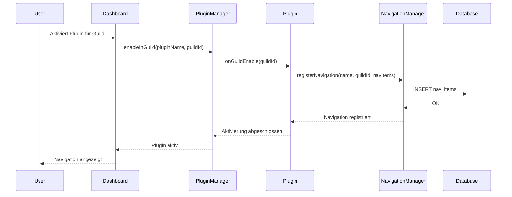

# 🗺️ Example Navigation Plugin

Dieses Plugin zeigt **Best Practices** für die Integration von **Navigation und Routen** in DuneBot Dashboard-Plugins.

## 📚 Was du lernst

1. **Routen registrieren** - Wie du Plugin-Routen unter `/guild/:guildId/plugins/:pluginName` verfügbar machst
2. **Navigation erstellen** - 3 verschiedene Wege, dein Plugin in die Sidebar zu integrieren
3. **Submenüs** - Wie du Untermenüs zu deinem Plugin oder zu bestehenden Menüs hinzufügst
4. **Lifecycle Hooks** - Wann Navigation registriert wird (`onGuildEnable`)

---

## 🎯 Navigation-Varianten

### **Variante 1: Eigenes Hauptmenü mit Untermenüs**

```javascript
await navigationManager.registerNavigation(this.name, guildId, [
    {
        title: 'Mein Plugin',
        url: `/guild/${guildId}/plugins/myplugin/dashboard`,
        icon: 'fa-solid fa-map',
        order: 60,
        parent: null  // Hauptmenü
    },
    {
        title: 'Analytics',
        url: `/guild/${guildId}/plugins/myplugin/analytics`,
        icon: 'fa-solid fa-chart-line',
        order: 61,
        parent: `/guild/${guildId}/plugins/myplugin/dashboard`  // Untermenü!
    }
]);
```

**Ergebnis:**
```
📊 Dashboard
⚙️ Einstellungen
🧩 Plugins
🗺️ Mein Plugin          ← Dein Hauptmenü
  ├─ 📈 Analytics        ← Dein Untermenü
  └─ 📄 Logs
```

---

### **Variante 2: Als Untermenü zu "Einstellungen"**

```javascript
await navigationManager.addSubmenu(
    this.name,
    guildId,
    `/guild/${guildId}/plugins/core/settings`,  // Parent URL
    {
        title: 'Plugin-Einstellungen',
        url: `/guild/${guildId}/plugins/myplugin/settings`,
        icon: 'fa-solid fa-puzzle-piece',
        order: 24
    }
);
```

**Ergebnis:**
```
⚙️ Einstellungen
  ├─ 🎛️ Allgemein
  ├─ 👥 Benutzer
  ├─ 🔌 Integrationen
  └─ 🧩 Plugin-Einstellungen  ← Dein Untermenü!
```

---

### **Variante 3: WordPress-Style Settings Page**

```javascript
await navigationManager.addSettingsPage(
    this.name,
    guildId,
    {
        title: 'Mein Plugin',
        url: `/guild/${guildId}/plugins/myplugin/settings`,
        icon: 'fa-solid fa-sliders'
    }
);
```

Wird automatisch unter "Einstellungen" eingehängt.

---

## 🛣️ Routen-Registrierung

### **Automatisches Route-Mounting**

Alle Routen in `this.guildRouter` werden automatisch unter `/guild/:guildId/plugins/:pluginName` verfügbar:

```javascript
class MyPlugin extends DashboardPlugin {
    constructor(app) {
        super({ name: 'myplugin', ... });
        this.guildRouter = express.Router();  // WICHTIG!
        this._setupRoutes();
    }

    _setupRoutes() {
        // Route: /guild/:guildId/plugins/myplugin/settings
        this.guildRouter.get('/settings', async (req, res) => {
            await themeManager.renderView(res, 'settings', {
                title: 'Einstellungen',
                guildId: req.params.guildId
            });
        });
    }
}
```

**Verfügbare URL:** `http://yourdomain.com/guild/123456789/plugins/myplugin/settings`

---

## 📋 Navigation Properties

| Property | Typ | Beschreibung | Beispiel |
|----------|-----|--------------|----------|
| `title` | String | Anzeigename in Sidebar | `"Mein Plugin"` |
| `url` | String | Route zum Plugin | `/guild/${guildId}/plugins/myplugin` |
| `icon` | String | Font Awesome Icon | `"fa-solid fa-map"` |
| `order` | Number | Sortier-Reihenfolge (10-100) | `60` |
| `parent` | String/null | Parent URL für Untermenü | `/guild/${guildId}/settings` |
| `type` | String | Typ (`main`, `settings`, `widget`) | `"main"` |
| `visible` | Boolean | Sichtbarkeit | `true` |

---

## 🔥 Icon-Referenz

**Verfügbare Icon-Sets:**
- **Font Awesome 6.5.1**: `fa-solid fa-*`, `fa-regular fa-*`
- **Bootstrap Icons 1.13.1**: `bi bi-*`

**Beispiele:**
```javascript
icon: 'fa-solid fa-gauge-high'    // Dashboard
icon: 'fa-solid fa-cog'           // Einstellungen
icon: 'fa-solid fa-puzzle-piece'  // Plugins
icon: 'fa-solid fa-chart-line'    // Analytics
icon: 'fa-solid fa-users'         // Benutzer
icon: 'bi bi-shield-check'        // Bootstrap Icon
```

---

## 🎯 Plugin Lifecycle



---

## ⚠️ Wichtige Hinweise

1. **guildRouter MUSS gesetzt sein**: Ohne `this.guildRouter` werden Routen nicht registriert
2. **Navigation in onGuildEnable**: Navigation wird **pro Guild** registriert, nicht global
3. **Parent URL exakt**: Parent muss exakte URL sein, nicht nur der Name
4. **Order-Nummern**: Core nutzt 10-50, nutze 60+ für eigene Menüs
5. **Duplikate vermeiden**: NavigationManager prüft automatisch ob Navigation schon existiert

---

## 🚀 Quick Start

1. **Plugin erstellen:**
   ```bash
   mkdir -p plugins/myplugin/dashboard
   cp plugins/_example-navigation-plugin/dashboard/index.js plugins/myplugin/dashboard/
   ```

2. **Anpassen:**
   - `name`, `displayName`, `icon` ändern
   - Routen in `_setupRoutes()` definieren
   - Navigation in `onGuildEnable()` registrieren

3. **Views erstellen:**
   ```bash
   mkdir -p plugins/myplugin/dashboard/views
   # View-Templates hier erstellen
   ```

4. **Plugin aktivieren:**
   - Dashboard → Plugins → "Mein Plugin" aktivieren
   - Für Guild aktivieren
   - Navigation erscheint in Sidebar!

---

## 📚 Weitere Ressourcen

- **NavigationManager API**: `packages/dunebot-sdk/lib/NavigationManager.js`
- **DashboardPlugin Base**: `packages/dunebot-sdk/lib/DashboardPlugin.js`
- **Core Plugin Beispiel**: `plugins/core/dashboard/index.js`
- **Template Plugin**: `plugins/_template/`

---

**Happy Coding! 🎉**
